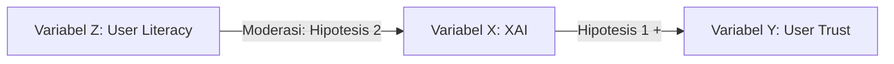

# Hypothesis or Proposition Builder

## Overview
Skill ini dirancang untuk memandu Research Agent dalam menerjemahkan kerangka teoretis dan celah penelitian menjadi pernyataan hipotesis yang dapat diuji (*testable hypotheses* untuk riset kuantitatif) atau proposisi logis (*propositions* untuk riset kualitatif/konseptual). Tujuannya adalah memastikan arah pengujian data memiliki dasar teori yang kuat.

## Dependencies
- `research-question-builder`

## Quick Start
Contoh penggunaan:
*"Gunakan skill hypothesis-or-proposition-builder untuk menyusun hipotesis hubungan antara penggunaan model XAI (Explainable AI) dengan tingkat kepercayaan pengguna akhir (user trust)."*

## Workflow

### 1. Analisis Landasan Teori Dasar (Theoretical Foundation)
- Identifikasi teori utama (*grand theory*) atau studi empiris terdahulu yang mendukung hubungan antar-variabel/konstruk.
- Jelaskan mekanisme teoritis yang melandasi mengapa hubungan tersebut diperkirakan ada (e.g., *Technology Acceptance Model (TAM)* untuk adopsi sistem).

### 2. Pemetaan Hubungan Logis / Kausal (Variables Mapping)
- Tentukan arah hubungan antar-variabel:
  - Hubungan Kausal Langsung (e.g., X berpengaruh positif terhadap Y).
  - Hubungan Moderasi (e.g., Z memperkuat/memperlemah pengaruh X terhadap Y).
  - Hubungan Mediasi (e.g., M menjembatani pengaruh X terhadap Y).

### 3. Visualisasi Kerangka Konseptual (Conceptual Framework Diagram)
Gambarkan diagram hubungan antar-variabel menggunakan format berbasis teks atau diagram Mermaid Markdown yang bersih. Contoh visualisasi:

### 4. Formulasi Pernyataan Hipotesis atau Proposisi
- **Hipotesis (Riset Kuantitatif)**: Buat pernyataan deklaratif yang spesifik, berarah, dan dapat diuji secara statistik (e.g., *H1: Penerapan visualisasi penjelasan model (XAI) berpengaruh positif secara signifikan terhadap tingkat kepercayaan (user trust) pengguna awam*).
- **Proposisi (Riset Kualitatif/Konseptual)**: Buat pernyataan logis yang memaparkan hubungan antar-konsep berdasarkan data kualitatif (e.g., *P1: Persepsi kegunaan visualisasi penjelasan bervariasi tergantung pada tingkat literasi digital dari masing-masing tipe aktor*).

## Common Mistakes & Aturan Kritis
- **Hipotesis Tidak Dapat Diuji (Untestable Hypothesis)**: Membuat pernyataan hipotesis yang normatif atau terlalu abstrak sehingga tidak dapat diverifikasi secara empiris dengan data kuantitatif.
- **Ketiadaan Justifikasi Teoretis**: Menyusun hipotesis hubungan dua variabel hanya berdasarkan asumsi subjektif agen tanpa menyertakan referensi teori dasar atau studi terdahulu.
- **Pernyataan yang Ambigu**: Menggunakan bahasa yang tidak terukur dalam hipotesis (e.g., *"Variabel X mungkin memengaruhi variabel Y secara tidak langsung"*). Gunakan arah hubungan yang jelas (positif, negatif, atau netral/dua-arah).
- **Inkonsistensi Istilah**: Menggunakan nama konstruk/variabel yang berbeda-beda antara bagian penjelasan teori, diagram kerangka konseptual, dan daftar hipotesis. Name konstruk harus konsisten 100%.
