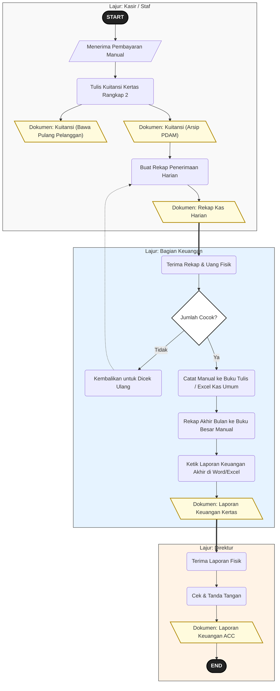
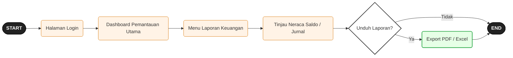
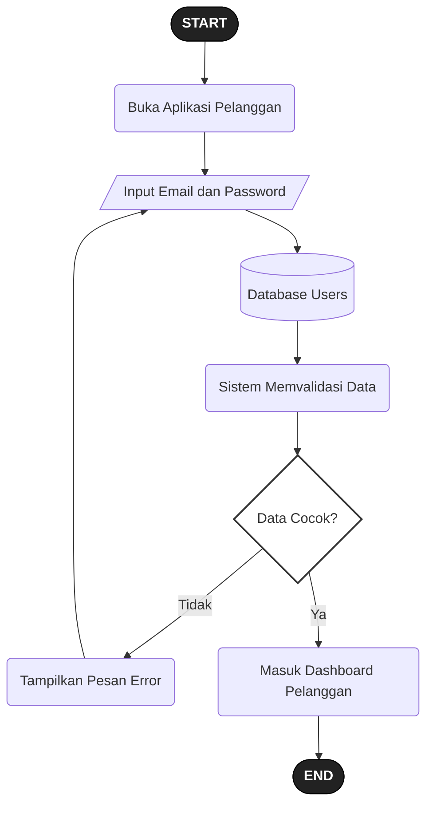
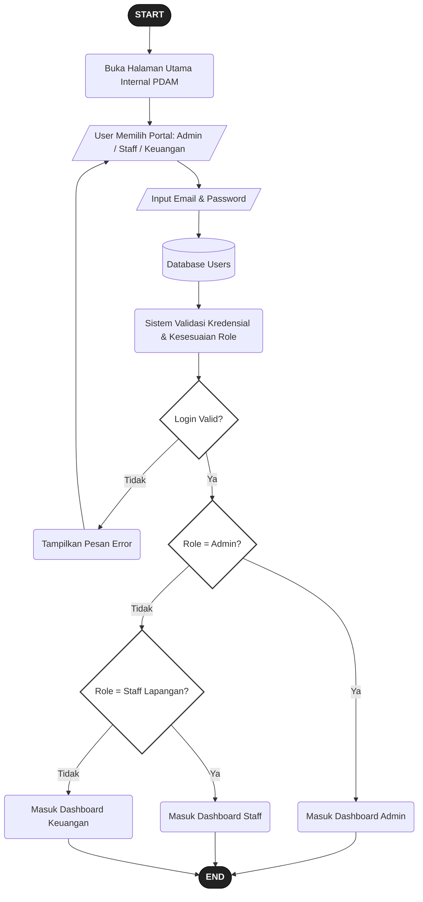
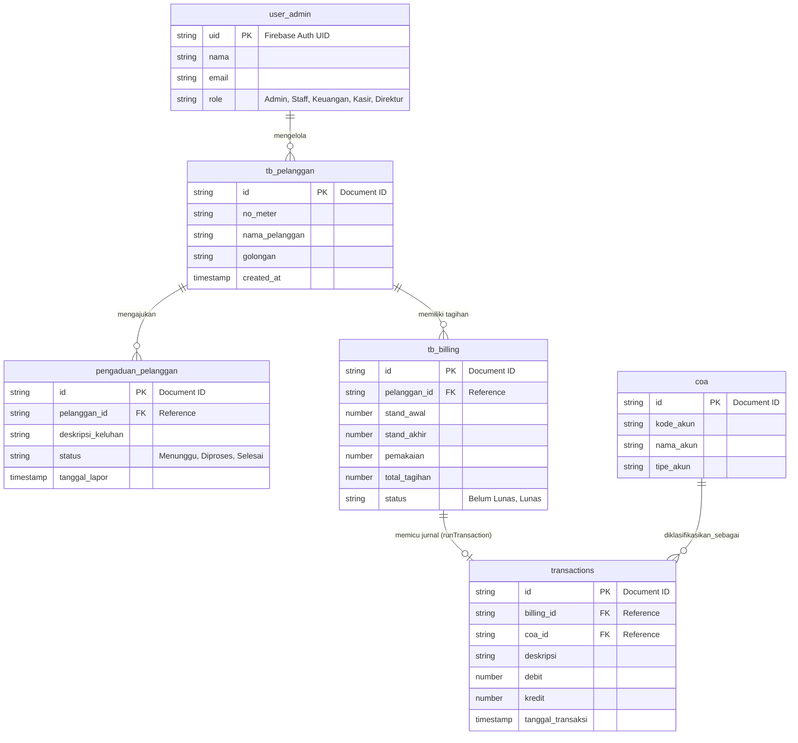
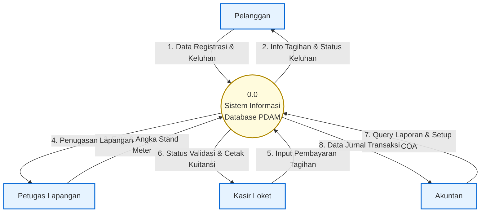
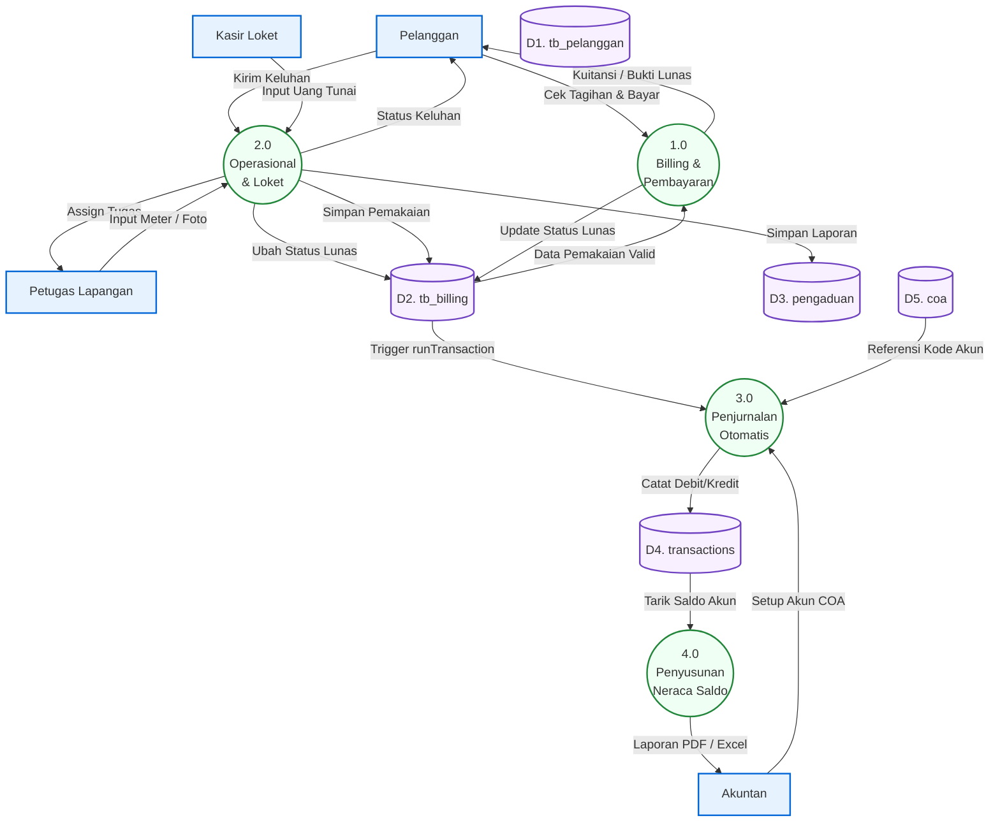
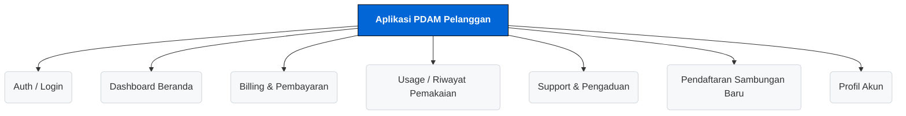

# Analisis dan Perancangan Sistem Aplikasi PDAM Tirta Seruyan

Dokumen ini berisi rancangan alur logika sistem (Flowmap) dan interaksi antarmuka pengguna (User Flow) yang digunakan sebagai lampiran laporan MBKM.

---

## 1. Flowmap (Cross-Functional Flowchart)

### A. Flowmap Prosedur Pembukuan Manual (Sistem Lama / Sebelum Aplikasi)


### B. Flowmap Pengaduan & Perbaikan (Sistem Usulan)


### C. Flowmap Pencatatan Meter, Tagihan & Akunting (Siklus Bulanan Sistem Usulan)


---

## 2. User Flow Aplikasi

### A. User Flow Aplikasi Pelanggan (Cek & Bayar Tagihan)


### B. User Flow Staff Lapangan (Input Angka Meter)

```mermaid
flowchart LR
    S_START([START]) --> A(Halaman Login)
    A --> B(Dashboard Staff)
    B --> C(Menu Tugas / Tasks)
    C --> D(Pilih Nama Pelanggan)
    D --> E(Form Input Stand Meter)
    E --> F{Data Valid?}
    F -- Tidak --> E
    F -- Ya --> G(Halaman Upload Foto)
    G --> H(Tugas Selesai)
    H --> S_END([END])

    style S_START fill:#222,stroke:#000,color:#fff,font-weight:bold
    style S_END fill:#222,stroke:#000,color:#fff,font-weight:bold
    style A fill:#fffbdd,stroke:#b08800
    style B fill:#fffbdd,stroke:#b08800
    style C fill:#fffbdd,stroke:#b08800
    style D fill:#fffbdd,stroke:#b08800
    style E fill:#fffbdd,stroke:#b08800
    style F fill:#fff,stroke:#333,stroke-width:2px
    style G fill:#fffbdd,stroke:#b08800
    style H fill:#e6ffe6,stroke:#28a745,stroke-width:2px
```


### C. User Flow Admin PDAM (Menugaskan Perbaikan Gangguan)


### D. User Flow Akuntan (Mengelola Laporan Keuangan)

```mermaid
flowchart LR
    S_START([START]) --> A(Halaman Login)
    A --> B(Dashboard Keuangan)
    B --> C(Menu Buku Besar)
    C --> D(Halaman Data Transaksi)
    D --> E{Perlu Edit Data?}
    E -- Ya --> F(Form Edit Transaksi)
    F --> G(Simpan Perubahan)
    E -- Tidak --> H{Cetak Laporan?}
    G --> H
    H -- Ya --> I(Download PDF / Excel)
    H -- Tidak --> S_END([END])
    I --> S_END

    style S_START fill:#222,stroke:#000,color:#fff,font-weight:bold
    style S_END fill:#222,stroke:#000,color:#fff,font-weight:bold
    style A fill:#fdf4ff,stroke:#6f42c1
    style B fill:#fdf4ff,stroke:#6f42c1
    style C fill:#fdf4ff,stroke:#6f42c1
    style D fill:#fdf4ff,stroke:#6f42c1
    style E fill:#fff,stroke:#333,stroke-width:2px
    style F fill:#fdf4ff,stroke:#6f42c1
    style G fill:#fdf4ff,stroke:#6f42c1
    style H fill:#fff,stroke:#333,stroke-width:2px
    style I fill:#e6ffe6,stroke:#28a745,stroke-width:2px
```


### E. User Flow Direktur (Pemantauan Keuangan)


### F. User Flow Kasir Loket (Pelayanan Pembayaran Fisik)


---

## 3. Flowchart Sistem

### A1. Flowchart Proses Login Aplikasi Pelanggan


### A2. Flowchart Proses Login Aplikasi Internal (Portal Pegawai)


### B. Flowchart Perhitungan Tagihan (Billing)
```mermaid
flowchart TD
    S_START([START]) --> A[/Sistem Menerima Input Stand Meter Baru/]
    
    A --> DB1[(Database: Meter_Readings)]
    DB1 --> B(Baca Data Stand Meter Bulan Lalu)
    B --> C(Hitung: Pemakaian = Stand Baru - Stand Lama)
    
    C --> DB2[(Database: Users & Golongan)]
    DB2 --> D(Cek ID Golongan Pelanggan)
    D --> E(Ambil Data Tarif Dasar & Biaya Admin)
    
    E --> F{Ada Tunggakan Sebelumnya?}
    F -- Ya --> G(Hitung: Tagihan = [Pemakaian * Tarif] + Admin + Denda)
    F -- Tidak --> H(Hitung: Tagihan = [Pemakaian * Tarif] + Admin)
    
    G --> I(Simpan Record Tagihan Baru)
    H --> I
    I --> DB3[(Database: Bills)]
    
    DB3 --> J[\"Dokumen: Invoice / Struk Tagihan Air"\]
    J --> S_END([END])

    style S_START fill:#222,stroke:#000,color:#fff,font-weight:bold
    style S_END fill:#222,stroke:#000,color:#fff,font-weight:bold
    style F fill:#fff,stroke:#333,stroke-width:2px
    style DB1 fill:#f9f0ff,stroke:#6f42c1,stroke-width:2px
    style DB2 fill:#f9f0ff,stroke:#6f42c1,stroke-width:2px
    style DB3 fill:#f9f0ff,stroke:#6f42c1,stroke-width:2px
    style J fill:#fffbdd,stroke:#b08800,stroke-width:2px
```

### C. Flowchart Proses Pembayaran & Pencatatan Kas


### D. Flowchart Pengajuan Sambungan Baru


### E. Flowchart Pengaduan / Pelaporan Gangguan


### F. Flowchart Laporan Keuangan (Jurnal & Buku Besar Akunting)


---

## 4. Entity Relationship Diagram (ERD) Basis Data

Berikut adalah arsitektur basis data relasional yang mengelola seluruh data operasional dan transaksi akuntansi (Buku Besar/Jurnal) di sistem PDAM.



---

## 5. Data Flow Diagram (DFD)

Meskipun secara konvensional DFD digambar menggunakan *tool* desain khusus, berikut adalah representasi arsitektur DFD menggunakan sintaks Mermaid (Flowchart Mode) untuk menggambarkan aliran data antar entitas (*Entity*), proses (*Process*), dan *Database* (*Data Store*).

### A. DFD Level 0 (Context Diagram)


### B. DFD Level 1 (Rincian Proses Utama)


---

## 6. Kamus Data (Data Dictionary)

Kamus Data berfungsi sebagai "buku spesifikasi teknis" pelengkap dari ERD. Jika ERD hanya menunjukkan gambaran relasi antartabel secara visual, maka Kamus Data merincikan tipe data (*Number*, *String*, *Timestamp*) dan batasan (*Primary Key*, *Foreign Key*) dari tiap *field* secara tekstual. Dokumentasi ini menjadi bukti komprehensif bagi penguji teknis bahwa arsitektur *database* dirancang secara terstruktur dan siap dieksekusi menjadi *source code*.

Berikut adalah detail skema data (Kamus Data) untuk koleksi NoSQL Firestore yang mendasari relasi pada ERD.

### 1. user_admin (Tabel: User)
Menyimpan data otentikasi dan hak akses seluruh entitas (internal & eksternal).
| Field | Tipe Data | Keterangan |
| :--- | :--- | :--- |
| `id` | String (PK) | Firebase Auth UID / Document ID |
| `name` | String | Nama lengkap |
| `email` | String | Email untuk login |
| `phone` | String | Nomor HP/WA |
| `role` | String | Jabatan (`admin`, `staff`, `customer`, `direktur`, `accounting`) |
| `status` | String | Status akun (`active`, `pending`, `blocked`) |

### 2. tb_pelanggan (Tabel: Profil Pelanggan & Golongan)
Menyimpan profil master data khusus pelanggan PDAM.
| Field | Tipe Data | Keterangan |
| :--- | :--- | :--- |
| `id` | String (PK) | Document ID Pelanggan |
| `golonganId`| String (FK)| Referensi ID kategori tarif (misal: R1, Niaga) |
| `address` | String | Alamat domisili lengkap |
| `avatar` | String | URL foto profil pengguna |

### 3. pengaduan_pelanggan (Tabel: Task)
Menyimpan manajemen perintah kerja lapangan terpadu.
| Field | Tipe Data | Keterangan |
| :--- | :--- | :--- |
| `id` | String (PK) | Document ID Task |
| `title` | String | Judul tugas/keluhan |
| `type` | String | Tipe tugas (`repair`, `reading`, `disconnection`, `new_connection`) |
| `status` | String | Status penyelesaian (`pending`, `assigned`, `in-progress`, `completed`) |
| `assignedTo`| String (FK)| ID Staff Lapangan yang bertugas |
| `customerId`| String (FK)| ID Pelanggan pelapor |
| `report` | Object | Menyimpan *notes* dan foto bukti eksekusi |

### 4. tb_billing (Tabel: Bill & MeterReading)
Menyimpan rekapitulasi penagihan dan hasil pembacaan meter.
| Field | Tipe Data | Keterangan |
| :--- | :--- | :--- |
| `id` | String (PK) | Document ID |
| `customerId`| String (FK)| Referensi ID pelanggan |
| `month/year`| String | Periode tagihan |
| `standAwal/Akhir`| Number| Pencatatan angka kubikasi air |
| `amount` | Number | Nominal Rupiah tagihan penuh (Pemakaian + Admin) |
| `status` | String | Status pembayaran (`paid`, `unpaid`) |

### 5. Jurnal & Keuangan (Tabel: COA & transactions)
Koleksi komprehensif untuk transaksi jurnal akuntansi.
| Field | Tipe Data | Keterangan |
| :--- | :--- | :--- |
| `id` | String (PK) | Document ID Transaksi/Buku Besar |
| `billingId` | String (FK)| Referensi ke ID penagihan lunas |
| `coaId` | String (FK)| Referensi ke *Chart of Accounts* |
| `debit` | Number | Pemasukan kas/aset |
| `kredit` | Number | Pengeluaran/kewajiban |

---

## 7. Peta Navigasi (Sitemap) Lintas Aplikasi

Sitemap (Peta Navigasi) adalah pemetaan struktur pohon yang menjabarkan hierarki seluruh halaman dan menu di dalam aplikasi. Fungsi utama sitemap ini adalah untuk memudahkan pembaca laporan (terutama pihak Manajemen PDAM atau dosen Non-IT) dalam membayangkan ruang lingkup fitur sistem secara utuh tanpa harus menjalankan aplikasi. Pemetaan ini sekaligus menjadi kerangka dasar penyusunan Modul Panduan Pengguna (*User Manual*).

Struktur menu di bawah ini memetakan komponen antarmuka yang aktual dikembangkan berdasarkan arsitektur modul sistem React.

### A. Peta Navigasi PDAM Pelanggan (Front-Office)


### B. Peta Navigasi PDAM Seruyan (Back-Office SIA)
```mermaid
flowchart TD
    ROOT[Aplikasi PDAM Seruyan SIA] --> MOD1{Modul Administrator}
    ROOT --> MOD2{Modul Staff Lapangan}
    ROOT --> MOD3{Modul Akuntansi & Direktur}

    MOD1 --> A1(Dashboard Analitik)
    MOD1 --> A2(Billing Management)
    MOD1 --> A3(Tarif Golongan Setup)
    MOD1 --> A4(Manajemen Keluhan / Repairs)
    MOD1 --> A5(Pantau Distribusi / WaterFlow)

    MOD2 --> S1(Daftar Perintah Kerja / Tasks)
    MOD2 --> S2(Input Stand Meter Air)
    MOD2 --> S3(Eksekusi Pemutusan Saluran)

    MOD3 --> K1(Dashboard Keuangan & Log Aktivitas)
    MOD3 --> K2(Jurnal Umum & Buku Besar)
    MOD3 --> K3(Neraca Lajur & Laporan Akhir)
    MOD3 --> K4(Hutang AP & Piutang AR)
    MOD3 --> K5(Daftar Rekening Ditagih & LPP)
    MOD3 --> K6(Aset Tetap & Persediaan)
    MOD3 --> K7(Rekonsiliasi & Anggaran)

    style ROOT fill:#28a745,stroke:#000,color:#fff,font-weight:bold
    style MOD1 fill:#fff3e6,stroke:#d97706,stroke-width:2px
    style MOD2 fill:#e6f3ff,stroke:#0366d6,stroke-width:2px
    style MOD3 fill:#f9f0ff,stroke:#6f42c1,stroke-width:2px
```

---

## 8. Catatan Keputusan Perancangan Sistem (Design Decisions)

Sebagai bentuk pertanggungjawaban akademis, berikut adalah penjabaran alasan analitis (*rationale*) di balik penyusunan diagram-diagram di dalam dokumen ini:

### A. Standarisasi Keputusan Logika (Boolean Decision)
Pada seluruh **Flowchart Sistem**, seluruh simbol belah ketupat (*Decision Point*) dibatasi hanya menggunakan format logika biner murni (**Ya/Tidak**). Tidak ada *output* ganda lebih dari dua cabang atau *output* yang bersifat ambigu. Hal ini dilakukan demi memenuhi standar penulisan algoritma komputasi akademis yang dapat dieksekusi oleh mesin.

### B. Penghindaran Garis Ruwet (Spaghetti Diagram)
Dalam penggambaran flowchart, beberapa instansi *Database* sengaja digambar ganda (misal: memunculkan `DB1` di awal proses, lalu memunculkan `DB1_UPDATE` di akhir proses meskipun keduanya mereferensikan koleksi yang sama). Keputusan ini diambil secara sengaja untuk menjaga estetika dan keterbacaan dokumen. Jika dipaksakan kembali ditarik ke satu simbol awal, garis (*flowline*) akan melompat mundur saling menabrak dan menciptakan *spaghetti diagram* yang membingungkan pembaca.

### C. Pemisahan Hak Akses Direktur & Akuntan (*Separation of Duties*)
Dalam *User Flow* dan rancangan *Role* ERD, peran **Direktur** dan **Akuntan (Keuangan)** dipisah menjadi entitas fungsional yang berbeda. Ini merupakan bentuk implementasi dari prinsip *Separation of Duties* dalam Sistem Informasi Akuntansi (SIA). Akuntan diberikan akses operasional untuk memanipulasi *database* (melakukan mutasi, koreksi jurnal, dan pencatatan). Sebaliknya, *role* Direktur dibatasi secara sistem dengan wewenang *Read-Only* (hanya dapat melihat *dashboard*, meninjau, dan mengunduh laporan Neraca Saldo) demi mencegah manipulasi data internal (*fraud*).

### D. Eksistensi Entitas Kasir Loket (*Hybrid Workflow*)
Meskipun hasil akhir sistem telah mendigitalisasi layanan secara mandiri (aplikasi PDAM Pelanggan), DFD Level 0, Flowmap, dan User Flow sengaja tetap mempertahankan eksistensi aktor **Kasir Loket**. Keputusan ini didasarkan pada realitas operasional demografi masyarakat daerah (Seruyan), di mana loket fisik PDAM tidak bisa dihapuskan 100% karena sebagian pelanggan konvensional tetap akan datang membawa uang tunai. Sistem *back-office* mengakomodasi *hybrid workflow* ini dengan menyediakan modul khusus Kasir agar pembayaran manual tetap tercatat secara *real-time* ke *database* terpusat.

### E. Mekanisme *Looping Balance* pada Laporan Keuangan
Pada flowchart **Laporan Keuangan (Jurnal & Buku Besar)**, ditanamkan mekanisme putaran balik (*error-looping*) ketika total Debit dan Kredit terdeteksi *Out of Balance*. Sistem dirancang untuk menolak penerbitan laporan akhir (*Hard-Block*) sebelum keseimbangan nilai matematis tercapai, dan akan melempar kembali notifikasi *error* agar Akuntan merevisi entri jurnal. Hal ini menjamin bahwa seluruh *output* dokumen finansial mematuhi Standar Akuntansi Keuangan (SAK) secara *strict*.
