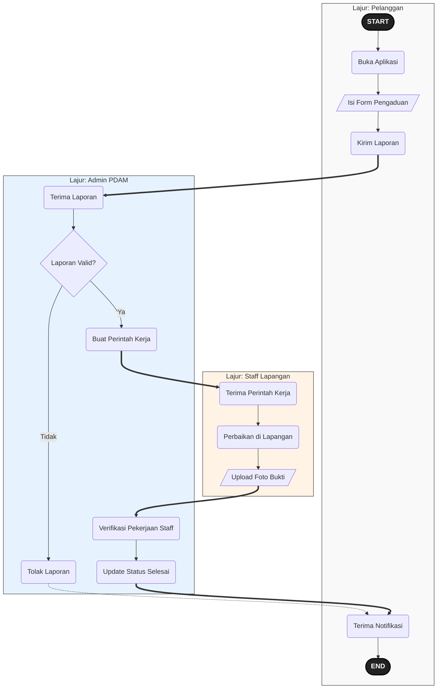
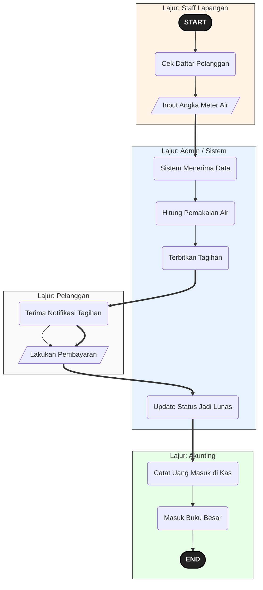
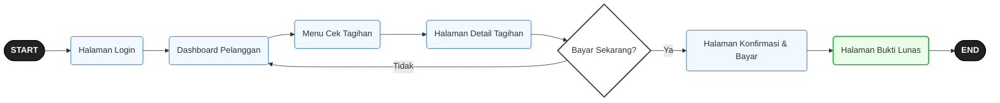
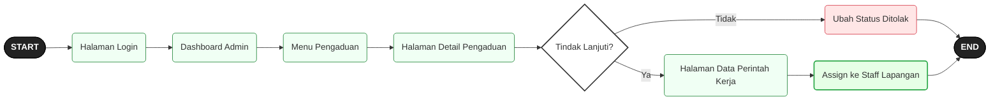
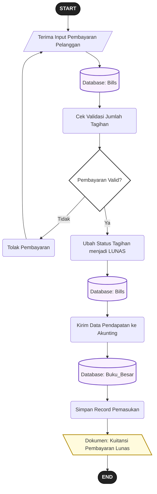
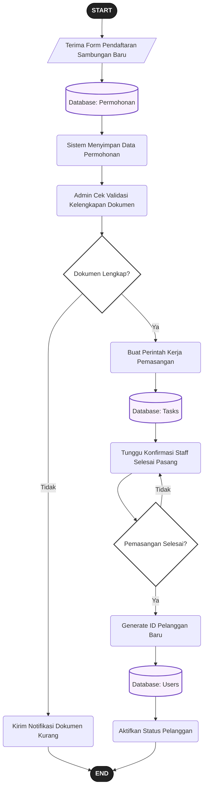
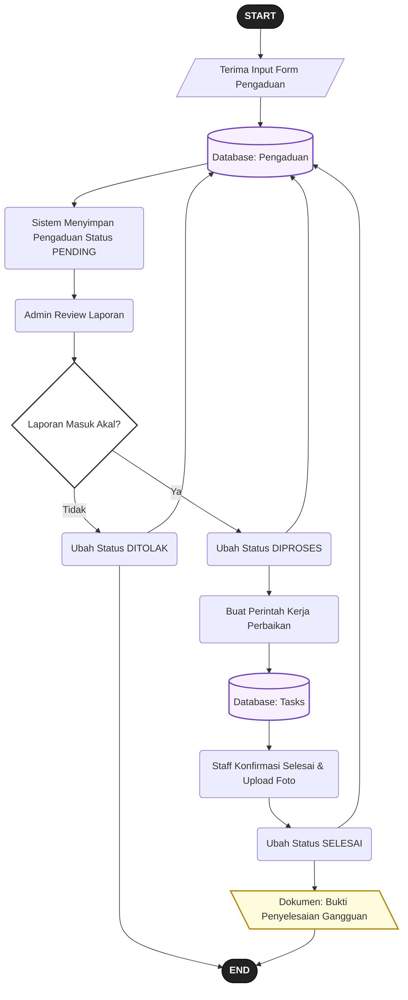
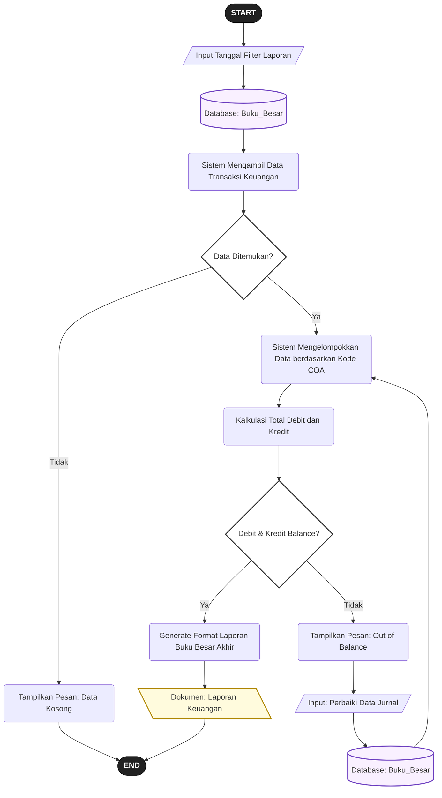

# Analisis dan Perancangan Sistem Aplikasi PDAM Tirta Seruyan

Dokumen ini berisi rancangan alur logika sistem (Flowmap) dan interaksi antarmuka pengguna (User Flow) yang digunakan sebagai lampiran laporan MBKM.

---

## 1. Flowmap (Cross-Functional Flowchart)

### A. Flowmap Pengaduan & Perbaikan


### B. Flowmap Pencatatan Meter, Tagihan & Akunting (Siklus Bulanan)


---

## 2. User Flow Aplikasi

### A. User Flow Aplikasi Pelanggan (Cek & Bayar Tagihan)


### B. User Flow Staff Lapangan (Input Angka Meter)


### C. User Flow Admin PDAM (Menugaskan Perbaikan Gangguan)


### D. User Flow Direktur / Akunting (Cek Laporan Keuangan)


---

## 3. Flowchart Sistem

### A1. Flowchart Proses Login Aplikasi Pelanggan


### A2. Flowchart Proses Login Aplikasi Internal (Portal Pegawai)


### B. Flowchart Perhitungan Tagihan (Billing)
```mermaid
flowchart TD
    S_START([START]) --> A[/Sistem Menerima Input Stand Meter Baru/]
    
    A --> DB1[(Database: Meter_Readings)]
    DB1 --> B(Baca Data Stand Meter Bulan Lalu)
    B --> C(Hitung: Pemakaian = Stand Baru - Stand Lama)
    
    C --> DB2[(Database: Users & Golongan)]
    DB2 --> D(Cek ID Golongan Pelanggan)
    D --> E(Ambil Data Tarif Dasar & Biaya Admin)
    
    E --> F{Ada Tunggakan Sebelumnya?}
    F -- Ya --> G(Hitung: Tagihan = [Pemakaian * Tarif] + Admin + Denda)
    F -- Tidak --> H(Hitung: Tagihan = [Pemakaian * Tarif] + Admin)
    
    G --> I(Simpan Record Tagihan Baru)
    H --> I
    I --> DB3[(Database: Bills)]
    
    DB3 --> J[\"Dokumen: Invoice / Struk Tagihan Air"\]
    J --> S_END([END])

    style S_START fill:#222,stroke:#000,color:#fff,font-weight:bold
    style S_END fill:#222,stroke:#000,color:#fff,font-weight:bold
    style F fill:#fff,stroke:#333,stroke-width:2px
    style DB1 fill:#f9f0ff,stroke:#6f42c1,stroke-width:2px
    style DB2 fill:#f9f0ff,stroke:#6f42c1,stroke-width:2px
    style DB3 fill:#f9f0ff,stroke:#6f42c1,stroke-width:2px
    style J fill:#fffbdd,stroke:#b08800,stroke-width:2px
```

### C. Flowchart Proses Pembayaran & Pencatatan Kas


### D. Flowchart Pengajuan Sambungan Baru


### E. Flowchart Pengaduan / Pelaporan Gangguan


### F. Flowchart Laporan Keuangan (Jurnal & Buku Besar Akunting)

